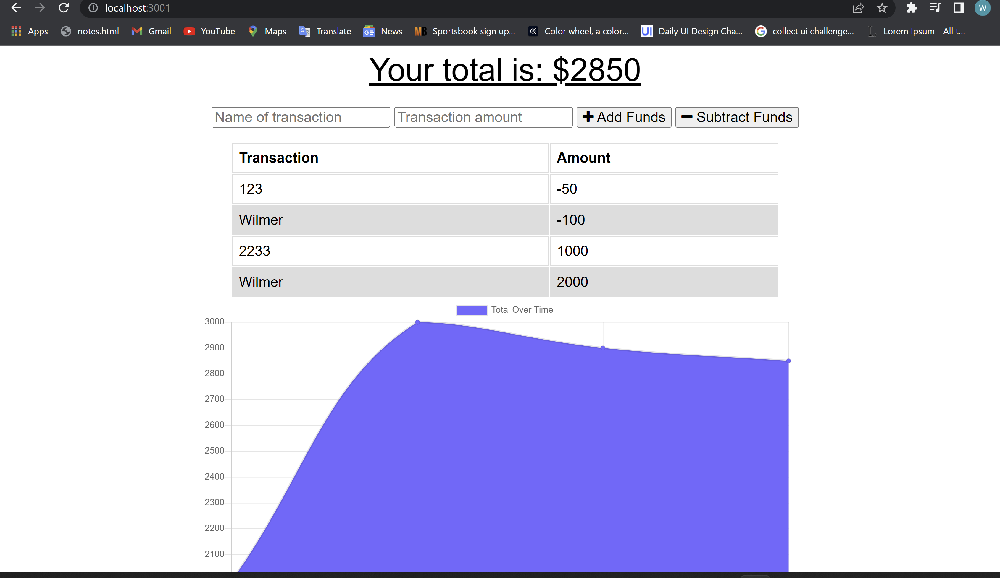

# Budget-Tracker-Challenge

## Table of Contents
- [Description](#description)
- [Installation](#installation)
- [Usage](#usage)
- [Contribution](#contribution)
- [Testing](#testing)
- [Screenshot](#screenshot)

## Description:
Project based on creating an app that allows user to track their expensive budggets by adding expenses and deposits and it offers offline features where most application don't have those advantages

## Installation:
We are going to used npm install in the terminal  to install all the packages needed.

## Usage:
We used the project by cloning the repo and and start the project by installing the dependencies using npm i, and then your going to go to the terminal and do a npm start  to display the server http://localhost:3001/ in the browser

## License:
This license is public used you can find it on:
https://opensource.org/licenses/MIT

## Contribution:
Yes you can contribute to the project by sending me  an email.

## Testing:
You can test the project by cloning the repository and start the project by installing the dependencies using npm i, and the next step your going to go the terminal and type npm start to run the project.

## Screenshot:

## Contact Information:
- Github: https://github.com/wilmerojeda13.
- Email: ojedawilmerantonio@gmail.com. 